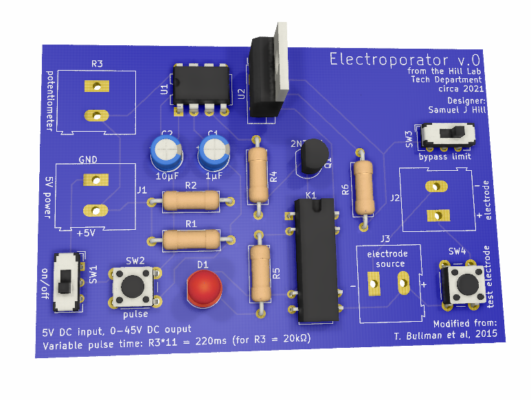
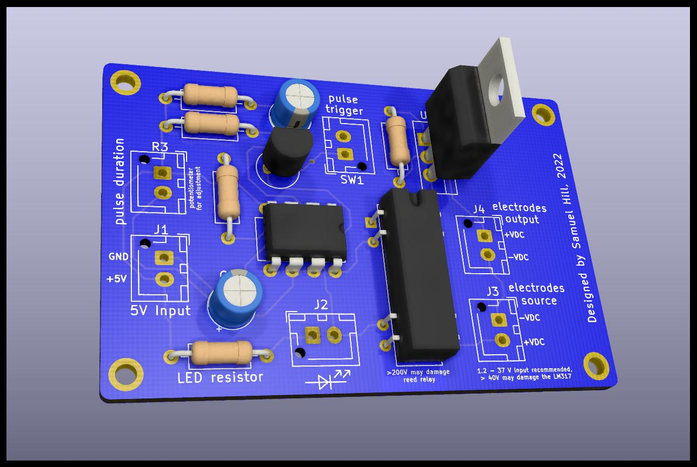

# Electroporator PCB

Various PCB designs for a simple, versatile, and inexpensive electroporator. Inspiration and original design from [T. Bullman, et. al. 2015](https://onlinelibrary.wiley.com/doi/10.1111/dgd.12216). As stated in the paper:

> Electroporation is a useful technique to study gene function during development but its broad application is hampered due to the expensive equipment needed.

While I agree with this and the rest of the paper largely, I believe the design set forth is both cluttered and unnecessarily complicated. This is mainly due to the use of a breadboard (or PCB breadboard), and given the current capabilities and price point of manufacturing a custom PCB this seems the obvious place to start for simplification. To that end, I designed a simple PCB that also contains much of the needed information for construction and operation on the silkscreen.

## Breadboard layout

To make sure I had the circuit correct and that my parts were compatible I did a test on a breadboard just as the paper laid out.

Breadboard build:

Testing with oscilloscope:

Sizing up PCB from breadboard layout:

## V.0 Design

Below are 2D and 3D renders of the v.0 design:

This board uses the same layout as the breadboard in terms of components and connections, but - due to the nature of PCBs - doesn't require extra wiring. While the parts listed in the paper are mostly generic and easy to come by such as the resistors, capacitors, and 555 timer, the reed relay is definitely a bit more of an unusual component. While not very expensive for the kind used here, it is unlikely you have a compatible IC lying around. Also, this is another change from the paper - albeit minor - in that the PCB is only designed for reed relays and not miniature latching relays. In addition to using reed relays, I am expecting a relay with diode protection. The relays I used for my testing and builds were [HE721A0510's](https://www.mouser.com/ProductDetail/Littelfuse/HE721A0510?qs=X8LBAgEWIKIfZjBxMXqqBA%3D%3D).

## V.1 Designs *(ordered components on wait lists - _IN PROGRESS & UNTESTED_)*

The v.0 system is reasonably simple and flexible (mostly due to the standard hole spacing for various IO connection types), but there are a few improvements I have thought of while building several v.0 electroporators. To start, all v.1 PCBs do not have a switch in the electrode side of the circuit as this was confusing and seems redundant. From here, I have made a JST connector only version as JST plugs are relatively low profile, dependable, and easy to install once setup. This replaces all screw terminals, buttons and switches, LED indicators, and potentiometer connections with JST plugs - making all IO consistently implemented.

The next v.1 iteration is a JST only copy with a more powerful current regulator in the form of a TL783. While previous versions were limited by the current regulator limitations, this version pushes further into the operational range for the reed relay and allows for pulse voltages from 1.25 to 125V. This opens up the ~45V - 125V range for systems that may require more power. To accommodate the adjust-ability of TL783 for regulating the current (I=Vref/R), R6 was beefed up to allow for radial resistors of appropriate values or a connection to appropriately spec'd potentiometers. These are the only modifications needed as the reed relay and JST connectors can already handle these voltages.

The JST only version could also be considered bloated if you know that your voltage is current regulated. If you were using a lab bench power supply with the current limited, the welding of the reeds in the relay should not be a concern. As such, I made a version with no current regulator for the most simple version of the circuit. This also opens up the full range of up to 200V for the relay so long as your power supply can handle those outputs limited to such low current values.

Lastly, in the interest of pushing the capabilities of this design, I created a kilo-volt version. At somewhere between 5x and 10x more expensive than the HE721, and with a > 1 year lead time, the [SHV05-1A85-78D4K](https://www.mouser.com/ProductDetail/MEDER-electronic-Standex/SHV05-1A85-78D4K?qs=3BE4VKEPqliBgklxw9NVYw%3D%3D) was my choice of overpowered reed relay for this electroporator. In addition to a bigger reed relay (no current regulation like above), the JST connectors won't cut it and have been replaced with kV compatible screw terminals.

## V.0 Implementations

Below are two of the implementations that went to be used in the Hill lab and have been tested on sponge cells. Imaging and further testing is ongoing.

### Large project box

#### Lid:

#### Sides:

#### Lid IO:

#### Sides IO:

#### IO Layout:

This is also the look of the final system (sans LED). The pulse trigger is a tattoo gun pedal so the electrodes can be positioned and operated by the users hands while the trigger can be done with your feet.

#### Power supply:

Yellow & black for 5V, red and black for variable power output...

#### Power IO:

Includes the LED for indicating when the pulse occurs...

IO with wires attached and organized...

Power IO removed from lid for next step...

#### PCB:

Power (5V and electrode variable), electrodes, and the electrode test button wiring...

Power switch, pulse duration potentiometer, and pulse LED indicator control wiring...

All PCB connections in place in box...

Cleaned up the lid wiring...

---

### Small project box

## Results

Using the large project box implementation in the lab with a set of adherent cell electrodes (pictured below):

Sponges (gemules adhered to some variety of 35mm glass bottom petri dish with a micro-well and cover glass) successfully electroporated with plasmids expressing GFP:

